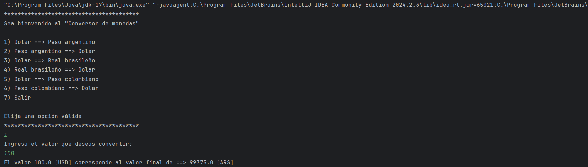

# ¡Hola, bienvenido a mi proyecto "Conversor de monedas"!

## Descripción del proyecto:

Este proyecto calcula el valor de la divisa argentina, brasileña y colombiana a dólares y viceversa, consumiendo la "ExchangeRate-API".

## Estado del proyecto:

Finalizado.

## Características de la aplicación:

* Este proyecto calcula el valor de la divisa deseada (argentina, colombiana, brasileña) a dolar estadounidense y viceversa mediante el uso de un menú mostrado al inicio.

* Consume la "ExchangeRate-API" para lograr la conversion en tiempo real.

* Tiene excepciones cuando el usuario introduce una opción no válida.

## Acceso al proyecto:

Público.

## Tecnoligías utilizadas:

* IntelliJ IDEA

* Java

* Gson

* ExchangeRate-API

## Conclusión:

El proyecto ofrece una solución al convertir el valor deseado de una divisa (ARS, BRL o COP) a dólares (USD) y viceversa, además valida si el usuario introdujo un valor válido, facilitando su reutilización en otras entradas.

## Desarrollado por:

### Luis Rivas

### Linkedin: https://www.linkedin.com/in/luis-rivas-c/