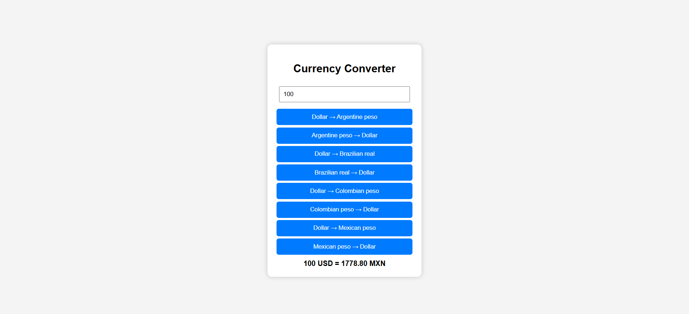

# Hello, and welcome to my project "Currency Converter"!

## Project Overview

This project is a Full-Stack Web Application that allows users to convert currencies between US dollars (USD) and Argentine pesos (ARS), Brazilian reals (BRL), Colombian pesos (COP), and Mexican pesos (MXN).

It leverages an external exchange rate API to provide accurate, real-time currency conversions, integrating both frontend and backend into a single application built with Spring Boot.

## Project Status

Completed and deployed.

## Key Features

* Interactive web interface for selecting currency conversions (USD ↔ ARS, BRL, COP, MXN).
* Real-time exchange rate retrieval using an external API.
* RESTful API built with Spring Boot.
* Dynamic frontend using JavaScript (Fetch API) to consume backend services.
* Input validation and error handling for invalid values and API failures.
* Full integration of frontend and backend in a single deployable application.

## Project Accessibility

The project is publicly available and deployed online via Railway.

## Tecnoligías utilizadas:

* Java
* Spring Boot
* JavaScript (Fetch API)
* HTML
* CSS
* ExchangeRate-API
* Git and Github
* Railway
* IntelliJ IDEA

## Architecture

* Backend developed using a layered architecture:
  * Controller (REST endpoints)
  * Service (API consumption and business logic)
* Frontend served directly from the backend (/static directory)
* Communication handled via HTTP requests (Fetch API)

## Conclusion

This project delivers a practical and efficient full-stack solution for real-time currency conversion. It demonstrates the integration of external APIs, backend development with Java and Spring Boot, and frontend interaction using JavaScript.

It also showcases deployment skills by hosting the complete application in the cloud, making it accessible through a single URL.

## Author

### Luis Rivas

### Linkedin: https://www.linkedin.com/in/luis-rivas-c/